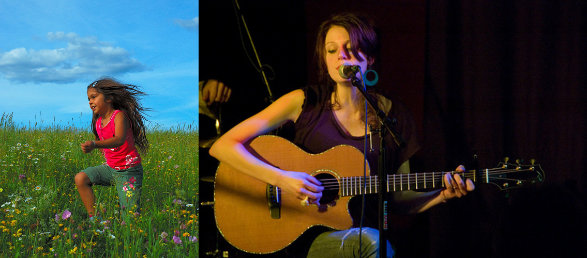
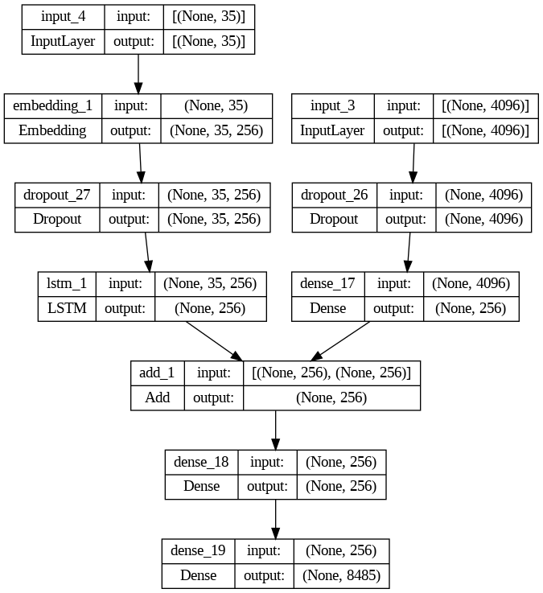
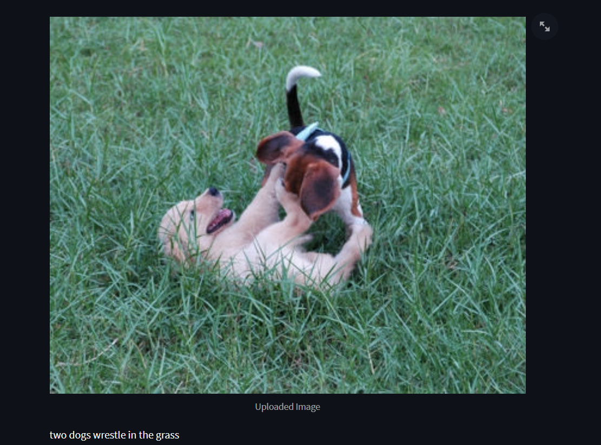
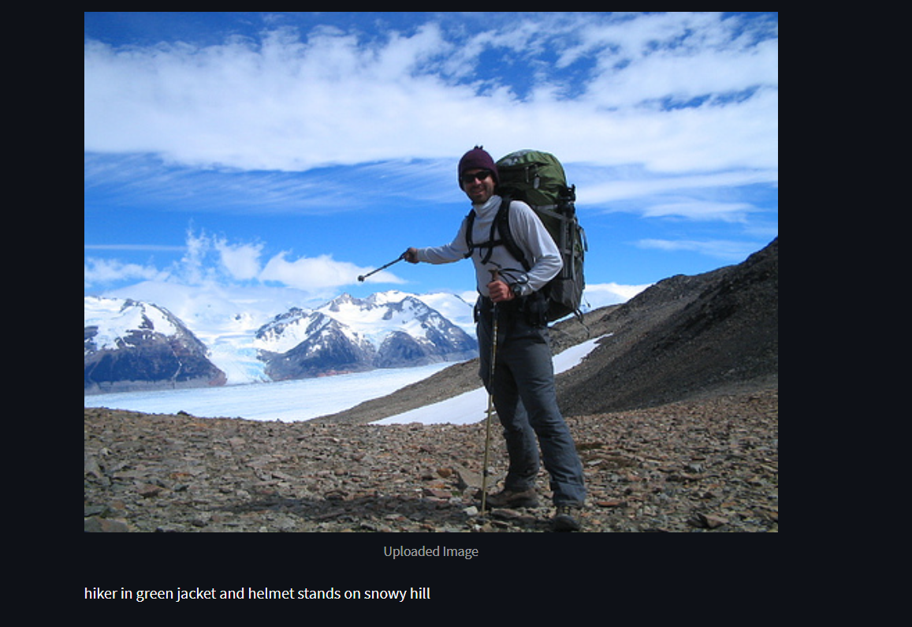

<h1 align="center">Image Caption Generator</h1>


# Table of Contents
- Table of Contents
- Basic Overview
- Demo
- Data Collection and Preprocessing
- Model Designing
- Results and Testing
- Deployment

# BASIC OVERVIEW :
* This Project is an attempt to generate **meaningful and appropriate textual captions** for images given as input.
* Generating captions, short descriptions and thumbnails for an image may be required and can be a time consuming task. This Project is an effort to effectively resolve such problems.<br>

# :film_projector: Demo :
https://github.com/Aasneh/Image_Caption_Generator/assets/96459729/15d0da9a-02a0-4436-9091-998b52c5f18a


# :floppy_disk:  DATA COLLECTION AND PREPROCESSING:
**DATASET LINK :** <https://www.kaggle.com/datasets/adityajn105/flickr8k> Flickr8k Dataset used .<br> 
* It has **8091 images with about 4-5 meaningful textual captions for each image** .<br>
* For Image Feature Extraction I have used a popular technique in Machine Learning called *Transfer Learning* .It uses a pretrained model to extract certain features of the input.<br>
* We shall be using the popular **VGG16 Model** to extract features from the input images .<br>
#### VGG MODEL:
* It is a 16 layer Deep Convolutional Neural Network . It has 13 **CNN** layers and 3 **Dense Fully Connected Layers** .It was pretrained to classify **1000 images**.
* It has an accuracy of about **0.92**. **Relu** is used as activation function and **softmax** in the last layer as the output class is large.
* Input Image must be of size **(224,224)** and we will use the output of the **2nd** last layer to get the final features of the image.<br>

* All the images are converted into arrays of size **(224,224,3)**(RGB Images). Each **2-D matrix** handles individually the components of **red, blue, green** pixels.<br>
* Each image's features are extracted and stored using the **VGG model** .<br>

#### HANDLING TEXTUAL DATA:
* Firstly, all the special characters such as *! , ?* etc. are removed from the captions. Each **character** is changed to lower case. *startsent* and *endsent* denote the starting and ending points of each caption.<br>
* Tokenization is used in natural language processing to split paragraphs and sentences into smaller units that can be more easily assigned meaning.
We have used a tokenizer to split the sentences into useful components. Vocab Size refers to the total number of distinct words in text corpus.

# :pushpin:  Model Designing :

* We will require 2 inputs namely, the **image features** and the **captions**<br>
* We will acquire the image features using the **VGG** model as a column vector of size **4096**. We will use a single **Dense** layer with **relu** activation to handle it.<br>
* For each caption we first convert it into a special sequence using *texts_to_sequences* of our **tokenizer** . We must feed our input like this :<br>

```javascript
eg)startsent black dog and spotted dog are fighting endsent
X                                       Y            
startsent                               black       
startsent black                         dog          
startsent black dog                     and          
.......
```

* **Embedding :** Embeddings translate large sparse vectors into a lower-dimensional space that preserves semantic relationships..<br>
* **LSTM :** Special type of **Recurrent Neural Networks (RNNs)**. LSTM has short term and long term cells which help in retaining previously acquired information.
Forget gate decides whether to reject the previously acquired information or not. In our working output of the current state depends on the **previously acquired textual outputs and image features** . Thus LSTM comes in handy for this model..<br>
* **adams optimizer :** Adaptive Moment Estimation is the technique used to update the gradient descent. Used for sparse data.<br>
* **categorical_crossentropy :** Categorical cross-entropy is used when true labels are one-hot encoded. Hence we use them.<br>
* Now we have added **2 Dense** layers which take the image and textual features into account and last layers uses **softmax** activation function to generate output<br>
* Model Summary Available at <https://github.com/Aasneh/Image_Caption_Generator/blob/master/modelsummary.txt><br><br>
<br><br>
# :bar_chart:  RESULTS AND TESTING :

<br>
<br>

<br>
<br>
# Deployment
**Deployed on Streamlit. Check it out! :** <https://imagecaptiongenerator.streamlit.app/>
